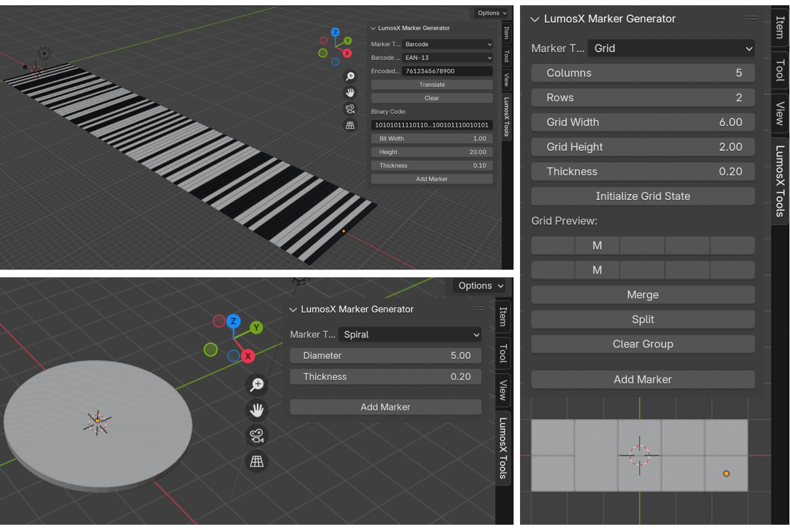

# LumosX_Marker_Generator

The Blender plugin supports the construction of three LumosX marker types: "Barcode," "Spiral," and "Grid," corresponding to barcode markers, tilting plates, and regular markers with grid structures, respectively.

To use this plugin, find the version of Blender (this example uses version 4.2), and place the file __init__.py under path:
`/Applications/Blender.app/Contents/Resources/**4.2**/scripts/addons_core/lumosX_generator`

Important Note: This version works for most cases, but it's possible to encounter some issues. The author is working on improving and upgrading to a better version. 
